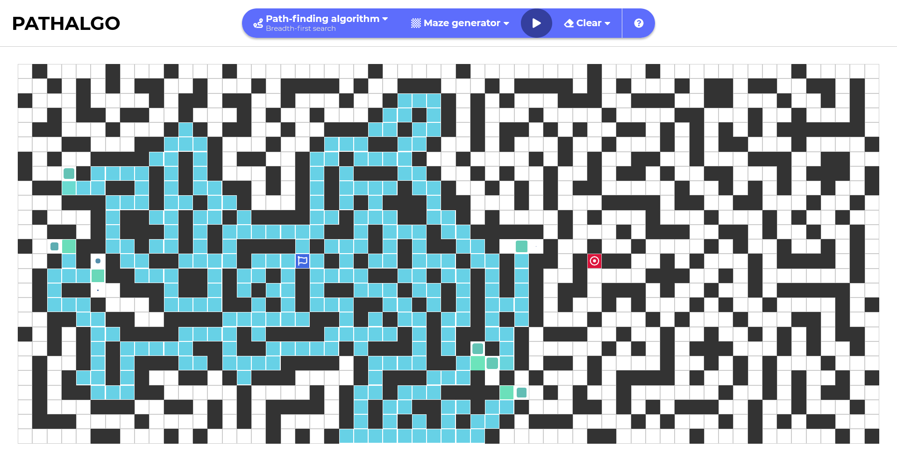

# Pathalgo - Path finding algorithm visualizer

**🌐 [nickon437.github.io/pathalgo](https://nickon437.github.io/pathalgo)**

## Features

- Finding shortest path from starting point to target
- Building/removing wall as obstacle
- Creating maze
- Moving starting point and target
- Re-calculating shortest path as board changes
- Using arrow keys to manually navigate through the board
- Creating board based on initial window's size

## Path-finding Algorithm

- [x] Breath-first search
- [x] Depth-first search

## Maze Gneration Algorithm

- [x] Random
- [x] Recursive division
- [x] Depth-first search
- [x] Hunt and kill

## Commands

- `npm i` to setup the app and install dependencies
- `npm run dev` to run code
- `npm run build` to build a production version
